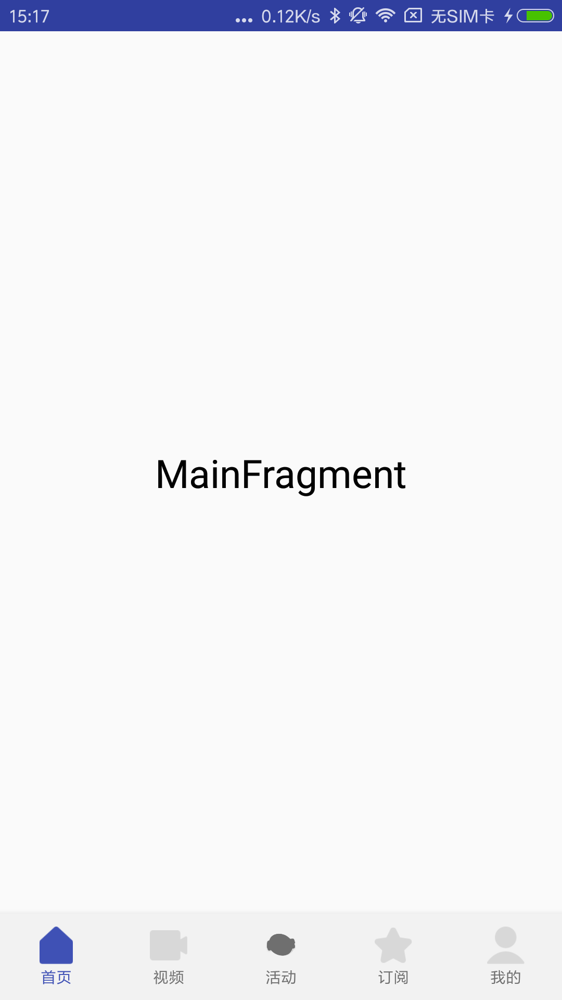

# Navigation
BottomNavigationView + NavHostFragment
 

 
 

秉着不重复造轮子的思想，参考了下面的优秀文章：
 
[Android官方架构组件Navigation：大巧不工的Fragment管理框架](https://blog.csdn.net/mq2553299/article/details/80445952)
 
[BottomNavigationView官方文档](https://developer.android.google.cn/reference/android/support/design/widget/BottomNavigationView.html)
 
[NavHostFragment官方文档](https://developer.android.com/reference/androidx/navigation/fragment/NavHostFragment)
 
 
 
NavigationView原理解析： 
[NavigationView 原理分析](https://blog.csdn.net/hesong1120/article/details/78288062)
[NavigationView 原理分析](https://blog.csdn.net/qq_18983205/article/details/78554634)